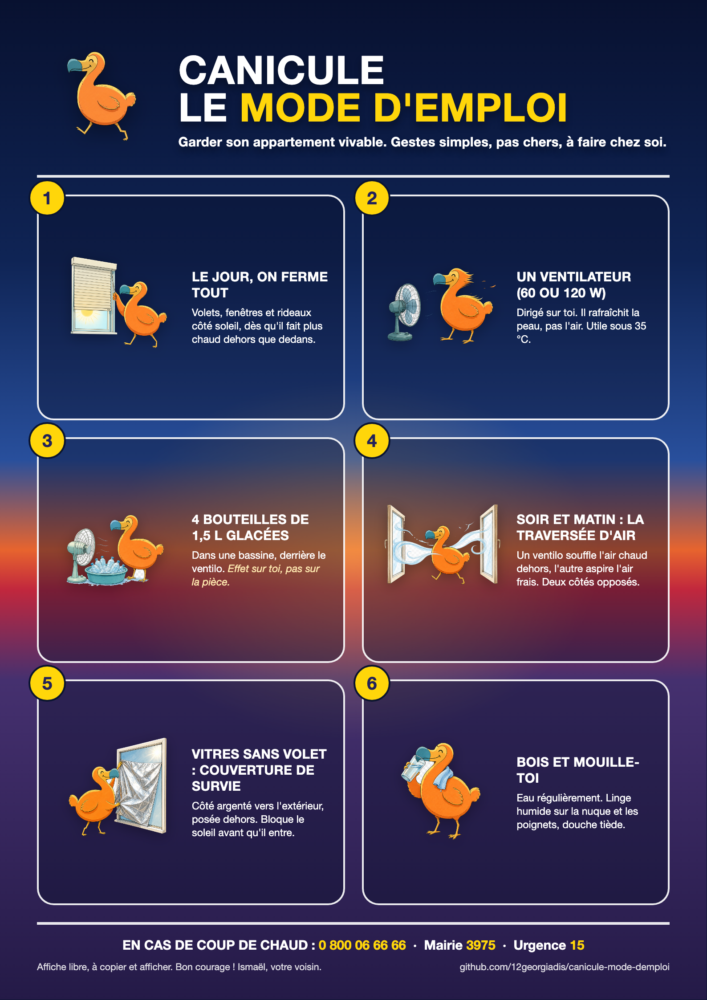

**English** · [Français](README.fr.md)

# Staying cool in an apartment during a heatwave

## A factual, engineer's-eye guide for dense Parisian housing during heatwaves

*Free-access guide, made to be copied, printed, posted in a building lobby, and improved. License CC BY-SA 4.0. See the "Reuse and share this guide" section at the end of the document.*

This guide gathers what physics and technical sources actually say about heat in an apartment. Every figure is dated and sourced at the end of the document. No value is invented. When a figure depends on the specific home or equipment, that is stated. When a figure does not exist reliably, that is said too.

The goal is to keep the signal and remove the noise: common myths are explicitly debunked (the fan that supposedly cools the air, the frozen bottle that supposedly air-conditions a room, potted plants that supposedly lower the temperature) with the physical explanation. The guide describes each person's margin for action, without taking a position on individual choices.

### What this guide contains

1. Understanding heat in an apartment (the simple physics).
2. The gestures that work, ranked by effectiveness, with an effectiveness/cost table.
3. Myths to forget, with the explanation.
4. Air conditioning, without taboo: types, efficiency, refrigerants, settings, installation, collective effect, when it is justified.
5. Computers and electronics during a heatwave.
6. Stay or act: what depends on you, on the community, on the landlord, on local authorities, plus existing support schemes.
7. Sources.

### The 5 key messages

1. **Stopping the sun from entering is lever number one.** A shade placed outside the window is roughly twice as effective as the same shade placed inside. An unprotected window lets through up to 80% of solar radiation.
2. **At night, you flush the heat out.** Open wide when outdoor air becomes cooler than indoor air (often after 9-10 pm and early morning), creating a cross-draft.
3. **A fan does not cool the air, it cools the skin.** Above roughly 35°C of air temperature, it becomes ineffective or even counterproductive, unless combined with water on the body.
4. **Air conditioning moves heat around, it does not make it disappear.** Properly set (26°C), it protects the individual but ejects their heat into the street. Choosing the unit and the setting changes everything.
5. **Whether or not to install air conditioning is each person's own call.** This guide gives the facts to inform that choice; it does not settle it.

---

## Poster to print for your building

An A4 poster ready to print and post in lobbies and on landings, summarizing the essential gestures.

Printable versions: [PDF A4](affiche/affiche-canicule-moebius.pdf) - [web page](affiche/affiche-canicule.html)

---

## 1. Understanding heat in an apartment

An apartment heats up through three physical mechanisms.

- **Solar radiation**: the sun passes through the glass and heats everything it touches inside. This is almost always the number-one source during a heatwave day.
- **Conduction**: heat slowly travels through walls, ceiling, and roof, from hot to cold.
- **Convection**: hot outdoor air enters through openings, gaps, and sealing defects.

Reference order of magnitude to keep in mind: a 2 m² bay window in full sun brings in as much heat as a running electric heater. An unprotected window lets through up to 80% of solar radiation (ADEME).

**Why a top floor heats up more.** Under the roof, the surface exposed to the sun is at its maximum and the roof's heat radiates downward into the home. The roof accounts for 25 to 30% of a home's heat loss (ADEME); in summer, an uninsulated roof under the sun becomes a hot plate above your head.

**Why exposed windows heat up more.** Glass is transparent to solar radiation (light) but opaque to the infrared re-emitted by hot objects. This is the greenhouse effect: light comes in, heats the room, and the heat stays trapped behind the glass. East- and west-facing walls capture the most sun in summer (low morning and evening sun, which penetrates deep into the room). To the south, the summer sun is high, so a simple overhang or a horizontal shade is often enough.

Direct consequence for the order of actions: **stopping heat before it enters is far more effective than fighting it once it's in.** Hence the hierarchy: block during the day, ventilate at night, cool the body as a last resort.

---

## 2. The gestures that work, ranked by effectiveness

### 2.1 Outdoor shading: the golden rule

The physics in one sentence: if you stop the sun **indoors** (curtain, indoor blind), the radiation has already crossed the glass, it has heated the room, and that heat stays trapped. If you stop it **outdoors**, the heat absorbed by the shutter or awning escapes into the outside air before it ever reaches the glass.

The measured figures:

- Closed outdoor shutters or awnings reduce solar gains by 60 to 80%, which can amount to 3 to 5°C less in the room compared to an unprotected window (ADEME).
- Real-world measurement, Poissy school, July 31, 2020: 38°C outside, a classroom with an outdoor awning at 26.9°C versus 32°C in a classroom without one, an over 5°C difference thanks to outdoor shading alone (Adaptaville/ADEME).
- Combined with good night ventilation, ADEME states you can cap a living room around 25-26°C while it is 38°C outside.

Two practical rules:

- **Always choose a light color.** A light-colored shutter or awning reflects radiation. A dark one absorbs it and becomes a hot plate stuck to the facade.
- **For the same fabric, outdoor placement wins by far over indoor.** To compare, technicians use the solar factor (the fraction of solar energy that passes through, between 0 and 1). The same fabric typically gives a factor around 0.1-0.2 mounted outside versus 0.4-0.55 mounted inside: an indoor blind lets through roughly twice as much heat as the same blind mounted outside.

### 2.2 Chalk whitewash on windows (whiting/blanc de Meudon)

This is the market-gardening technique for shading greenhouses, at very low cost. Blanc de Meudon is a natural chalk (calcium carbonate) sold as a powder. You make a fluid paste and apply it with a brush or sponge on the **outer face** of the windows.

Why it works: a white layer reflects a large part of solar radiation before it crosses the glass. It is a low-tech form of outdoor shading, the same principle as a light-colored outdoor awning.

- Common ratio: about 100 g of powder per 50 ml of water, as a fluid paste.
- Cost: a few euros to treat several windows.
- Reversible: it washes off with water, and rain eventually rinses it away. Apply it at the start of summer, remove it in autumn.

Limitations: the room turns into a milky half-light and the view is degraded. The precise temperature-drop figures that circulate (for example "7°C less") mainly come from blogs and are not based on a standardized measurement; treat them as estimates. The mechanism itself is solid and identical to that of a light-colored outdoor awning. Useless on a window already protected by an outdoor shutter or awning.

### 2.3 Cross-ventilation at night

Once the sun is blocked during the day, the heat accumulated overnight must be flushed out, when outdoor air becomes cooler than indoor air again.

The non-negotiable timing rule: **only open when the outdoor temperature is lower than the indoor one.** During a heatwave, this typically happens after 9-10 pm and early in the morning before 7-8 am (ADEME). Opening during a scorching afternoon lets the furnace in.

Cross-ventilation: opening two windows on opposite facades creates a draft that sweeps through the whole volume, far more effective than a single window. When the outdoor/indoor differential is favorable, drops of several degrees are observed within an hour.

What amplifies the effect:

- Chimney effect: open low and high (or use the stairwell, a roof window); hot air rises and escapes, cool air enters from below.
- Also ventilate the bedrooms and bathroom, often forgotten, to purge the entire air mass.

If the home is not cross-ventilated (all windows on the same side), the effect is limited. You can then open toward the stairwell if its air is cooler, or create a draft with a fan pointed outward to push hot air out. This last option partly depends on the building's rules (fire door, safety).

### 2.4 Refuge room

Rather than trying to cool the entire home, effort is concentrated on one room, ideally the bedroom, door closed. The smaller and more enclosed the volume, the more effective any measure (shading, ventilation, air conditioning if any) becomes. This is the most rational strategy when means are limited.

### 2.5 Cooling the body

This is the most direct and safest lever when the air itself is too hot for anything else. Evaporating water absorbs a lot of energy (latent heat of vaporization of about 2,260 kJ per kg), drawn from the skin.

- Lukewarm showers or baths (not ice-cold, which causes a rebound effect), misting spray, damp cloth or glove on the neck, wrists, face, several times a day.
- Misting and using a fan at the same time: the airflow speeds up evaporation on the skin, the winning combination.
- Drink regularly. A fan increases water loss (on the order of 125 g per hour according to published measurements); dehydration cancels out any benefit.

### Effectiveness/cost table for passive measures

| Measure | Effectiveness (sourced order of magnitude) | Cost | Reading |
|---|---|---|---|
| Outdoor shading (light-colored shutter/awning) | Blocks 60 to 80% of solar gain; 3 to 5°C less, over 5°C measured at Poissy | €15-60 (screen), €150-1,300 (awning/shutter) | The most cost-effective lever. Often a landlord/co-op decision |
| Chalk whitewash on the glass (outdoor) | Reflective shading, same principle as a light-colored awning | €2-5 | Best effectiveness-to-price ratio without works, at the cost of the view and light |
| Cross-ventilation at night | Several degrees in under 1 hour when outside is cooler than inside | €0 | Essential and free. Useless if opened at the wrong time |
| Indoor shading (curtain/light-colored blind) | Roughly 2 times less effective than outdoor | €20-200 | Better than nothing. The only option a tenant can freely install |
| Misting and damp cloth on the body | Cools the body directly through evaporation | €0-15 | The safest option when the air itself is too hot. Combine with a fan |

---

## 3. Myths to forget

### Myth 1: a fan cools the air in the room

False. A fan does not lower air temperature, it stirs it. Its motor even adds a tiny bit of heat. The only cooling effect is on the skin: the airflow speeds up sweat evaporation, creating a sensation of coolness. The effect is estimated at 2 to 3°C less in perceived temperature (ADEME), on the body, not on the thermometer. In an empty room, it does nothing and warms it very slightly.

The heatwave trap: as long as the air is cooler than the skin (around 35°C), stirring the air removes heat from the body. Beyond that, the fan pushes air hotter than the skin toward the body and speeds up dehydration with no warning sign. Santé publique France describes fans as ineffective, even counterproductive, above 35°C. The World Health Organization recommends using them only below 40°C (beyond that, fans warm the body). Between 35 and 40°C, they only help combined with water on the skin (misting, damp cloth). The dry/humid nuance matters: in very dry, very hot air, the benefit disappears sooner; for elderly people, it fades as early as 33-35°C according to published studies.

### Myth 2: a frozen bottle or a tray of ice cubes air-conditions the room

False at the scale of a room. Simple calculation: melting 1 kg of ice absorbs about 334 kJ (latent heat of fusion of water, a physical constant). A roughly 1-liter bottle that melts in 2 hours thus provides an average cooling power of about 46 W. Compare that to a portable air conditioner delivering 2,000 to 3,500 W of cooling: the bottle provides less than 2% of an air conditioner's power. And the room receives several hundred to over a thousand watts through the windows during the day. 46 W can do nothing against that. On top of that, the ice condenses moisture from the air and humidifies the room.

The only useful application: placing the ice in front of a fan, close to you, to cool the airflow on the skin, locally and briefly, long enough to fall asleep. This is not air conditioning.

### Myth 3: potted plants lower the room's temperature

Very marginal indoors. A plant cools through evapotranspiration (it evaporates water, which consumes heat). A large indoor plant evaporates at best around 1 liter per day. That liter per day corresponds to an average cooling power of about 26 W for a large plant. Compare that to the roughly 1,000 W entering through a single sun-facing bay window: a plant offsets about 2.5% of a window's gain. It would take dozens of them for a one-degree effect, and their transpiration would raise humidity.

To remember: a potted plant does not measurably lower a room's temperature and does not replace a closed shutter. On the other hand, trees and vegetation outside (facade shading, balcony, tree-lined street) genuinely cool things down, because they block the sun before it enters and act on a large open volume of air.

### Myth 4: setting the air conditioner very low cools faster

False and costly. Cooling speed depends on the unit's power, not on the set point. Setting 18°C does not cool faster than 26°C: it just makes the unit run longer and cost more (about 7% more consumption per degree), with a risk of thermal shock.

### Myth 5: keep the shutters closed permanently

Half false. Closing during the day, yes. But keeping everything closed at night prevents the accumulated heat from escaping, and the room stays hot in the morning. Good practice is alternation: shade during the day, open and ventilate at night.

---

## 4. Air conditioning, without taboo

One idea structures everything else: an air conditioner does not manufacture cold, it **moves heat around**. It takes heat from one side (the room) and ejects it on the other (the street). It is a heat pump running in cooling mode. This sentence resolves half the misunderstandings: the extracted heat has to go somewhere, so a unit that vents nothing outside cannot cool a room, and the heat ejected outside does not disappear.

### 4.1 Types of units

**Single-hose portable (monobloc).** Everything is in a wheeled box; a hose runs out the window to vent hot air. A major, often misunderstood physical flaw: to eject the hot air, the unit draws air from the room and blows it outside. That air must be replaced, and it is, by hot outdoor air seeping in through gaps. The unit creates a negative pressure that pulls in hot air from outside. Decisive practical consequence: **sealing the hose with a window sealing kit determines the real efficiency.** Without it, part of the cold produced is spent cooling the hot air that just came in.

**Portable split (two units connected, on wheels).** The compressor and condenser are moved to a module placed on the balcony, connected by a flexible hose to the indoor mobile unit. No hose blowing room air outside, so little to no negative pressure. More efficient and quieter than a monobloc, but more expensive and bulkier. A niche category.

**Fixed wall-mounted split (installed by a professional).** An indoor wall unit and a fixed outdoor unit, connected by a sealed refrigerant circuit. No air hose, no negative pressure. This is the most efficient and quietest installation on the room side, but it requires drilling through the wall and mounting an outdoor unit on the facade, which needs the landlord's and often the co-op's approval.

### 4.2 Efficiency

The hierarchy is clear: **fixed split beats portable split, which beats monobloc.**

- A portable air conditioner can consume up to 2.5 times more than a fixed unit (ADEME). At equal power, a portable unit consumes roughly 30 to 50% more than a fixed split.
- Portable units often display the EER (instantaneous efficiency). A fixed split is judged on the SEER (seasonal efficiency), a more honest indicator. Rule of thumb: a SEER of 6 means 6 kWh of cooling produced per 1 kWh consumed. Class A++ corresponds to a SEER of roughly 6.1 to 8.5.
- Inverter technology (compressor modulation) brings finer regulation and savings compared to an on/off unit (ADEME).

Consumption orders of magnitude, to adjust based on tariff and usage duration: ADEME puts a portable air conditioner at around 710 kWh per year, roughly €140 per year in typical use. The hourly costs often cited (around €0.20 per hour for a portable unit, €0.17 per hour for a fixed A++ split) come from commercial sources and should be taken as orders of magnitude.

On noise, sources are commercial and diverge somewhat: a monobloc typically sits between 55 and 70 dB, because the compressor is in the room; a split (portable or fixed) drops much lower, often 30 to 45 dB, since the compressor is outside.

### 4.3 Refrigerants and pollution: what "it pollutes" actually means

The refrigerant carries heat through the circuit. It is classified by its global warming potential (GWP), i.e. how many times more it warms than CO2 (whose GWP is 1).

| Refrigerant | GWP | Equivalent of 1 kg leaked | Status |
|---|---|---|---|
| R290 (propane) | about 3 | about 3 kg of CO2 | The most virtuous option; flammable, so limited charge amounts |
| R32 | about 675 | about 675 kg of CO2 | Current standard; about 68% less greenhouse gas than R410A |
| R410A | about 2,088 | over 2 tonnes of CO2 | Former standard; banned for new installations since January 1, 2025 |

What "it pollutes" actually means, in concrete terms, is not the air blown by the unit, but: any refrigerant leaks (the most impactful factor in case of an incident), the electricity consumed by the compressor, the manufacturing of the unit, and its end of life (the refrigerant must be recovered, never released).

A properly installed air conditioner, with a sealed and airtight circuit, does not leak in normal use. Leaks come from bad installation, an impact, corrosion, or a defect. This is why European regulation on fluorinated gases requires leak checks for equipment above a certain refrigerant volume, and mandatory recovery of the refrigerant at any service or end of life.

Regulatory trajectory: since January 1, 2025, low-power monosplits containing a high-GWP refrigerant are banned from new sale, ruling out R410A. On January 1, 2029, the threshold drops to around GWP 150, which will also rule out R32 from standard residential use in favor of natural refrigerants like R290. When buying, favor a unit using R290, failing that R32, never R410A (which is no longer sold new anyway).

### 4.4 What temperature to set

ADEME recommendation: do not go below 26°C, and keep a maximum gap of 5 to 7°C with the outside. Two combined reasons:

- Consumption: each degree less costs about 7% more. Setting 24 instead of 26 means roughly 14% more consumption for a comfort difference the body barely notices when humidity is under control.
- Health: beyond a 5-7°C gap between outside and inside, the body suffers a thermal shock when moving between environments, a risk for fragile, elderly, or cardiac people.

The right setting is 26°C, possibly adding light air movement (a fan makes it feel 1 to 2°C cooler without cooling the air).

### 4.5 Optimal installation

From most to least effective:

1. Shade before cooling. Air-conditioning a room where the sun shines directly in is fighting a running heater.
2. A single refuge room, door closed. Concentrate the unit on a small enclosed volume.
3. Seal a monobloc's hose, a non-negotiable step to remove the negative pressure and hot-air intrusion.
4. Maintain the filters: a cleaning every 6 months for an individual unit; a clean filter means up to 10% less consumption (ADEME).
5. For a fixed split: installation by a certified professional (refrigerant handling is regulated), outdoor unit ventilated and shaded if possible, and prior authorization from the landlord and co-op.

### 4.6 The collective effect: air conditioning heats the street

This is physics, not a judgment. The heat extracted from a room is ejected into the street. When many units do this at the same time, the street measurably heats up. Reference measurements in Paris (de Munck et al. study, 2013):

- With the air conditioner fleet of the time, the ejected heat raises street air temperature by about 0.5°C.
- If all that heat were released as dry hot air, the effect would rise to about 1°C.
- In a scenario where the air conditioner fleet doubles, up to about 2°C in the streets.
- The effect is stronger at night than during the day, and it is the hot nights that weigh most heavily on health.

For scale, Paris's urban heat island effect is already on the order of several degrees on average between the city and the countryside, with punctual nighttime gaps that can exceed 10°C (Météo-France). CEREMA describes air conditioning for this reason as "maladaptation": it protects the individual indoors while worsening the collective problem outdoors. Conversely, a CNRS study (2020) estimates that in Paris, combined measures (greening, insulation, reflective roofs, moderate use of air conditioning) would allow a notable temperature reduction compared to an all-air-conditioning scenario.

Factual conclusion: air conditioning transfers heat from your home to the street, and a little to your neighbors. It is a real trade-off, worth knowing about.

### 4.7 When air conditioning is justified

For health reasons:

- Vulnerable people: elderly people, infants, people with chronic illness, cardiac patients or people on certain treatments, pregnant women. For them, extreme heat is a vital risk.
- Repeated tropical nights (temperature not dropping below about 20°C): the body does not recover, sleep and cognitive functions deteriorate. An air-conditioned refuge room at 26°C is then a health measure.
- Heatwave peaks where passive measures no longer suffice to keep the indoors under a bearable threshold.

In these cases, a properly set air conditioner (26°C, R290 refrigerant, sealed hose, a single room) is worth more than a health risk. Outside these cases, passive measures are often enough, cost less, and do not heat up the street.

### Air conditioner comparison table

| Criterion | Portable monobloc | Portable split | Fixed wall split |
|---|---|---|---|
| Principle | All-in-one, hose through the window | Indoor mobile unit + outdoor module | Indoor and outdoor units, sealed circuit |
| Efficiency | The lowest (up to 2.5 times the consumption of a fixed unit) | Intermediate | The best (high SEER, Inverter) |
| Key flaw | Negative pressure, hose to seal | Bulk, niche | Works and authorization required |
| Noise (room) | High: 55-70 dB | Low: 30-45 dB | The lowest |
| Purchase cost | The lowest (spikes during heatwaves) | Intermediate | €800-2,000 installed |
| Running cost | The highest | Intermediate | The lowest |
| Works/authorization | None (plug + window) | Light (balcony module) | Yes: facade drilling + landlord/co-op approval |

---

## 5. Computers and electronics during a heatwave

A counterintuitive but central point: **a powerful machine is a heater.** Nearly all the electricity a computer consumes ends up as heat in the room (first law of thermodynamics, Joule heating). A PC drawing 500 W from the wall heats the room as much as a 500 W heater. This has nothing to do with brand.

Orders of magnitude, from most sober to hottest:

| Device | Typical power / heat |
|---|---|
| Internet box on standby | about 7 to 15 W |
| Small desktop computer idle | a few watts (e.g. 4 W) |
| Office laptop | about 50 W |
| Office desktop PC | about 150 W |
| High-end graphics card at full load | 450 to 575 W depending on model |

A workstation with a high-end graphics card can therefore dissipate several hundred watts into the room, equivalent to a small space heater running continuously.

What heat does to machines:

- **Thermal throttling.** A processor or graphics card that overheats deliberately reduces its clock speed to produce less heat. The machine gets slower. Processors start throttling around 95-100°C of chip temperature, graphics cards around 83-87°C. Room temperature adds to the chip's own temperature: the hotter the air, the faster the chip hits its ceiling.
- **Instability.** Beyond throttling, an overheating machine can freeze, restart, or shut down as a safety measure. These are normal protections.
- **Fanless laptops.** A fanless laptop has only one lever once the chassis is saturated: slow down the chip. Under sustained load, degradation is progressive and can reach several tens of percent less performance compared to a cooled machine. This is the worst choice for a long task in high heat.
- **Lithium-ion batteries.** This is the component heat damages the most, irreversibly. The combination of high heat and 100% charge is the worst case: the electrolyte degrades that much faster. The Arrhenius rule indicates that a rise of a few degrees noticeably speeds up aging. The exact swelling threshold depends on the cell and cannot be generalized. Usual recommendation for storing a battery: around 40 to 60% charge, in a cool place (10 to 25°C). Avoid charging to 100% in direct sunlight.
- **Drives.** For mechanical drives (NAS, older PCs), heat remains an aging factor, with manufacturer ranges generally of 5 to 55°C whose reliability degrades at the upper end. Solid-state drives are more tolerant but can also throttle if overheated.

The heatwave's double penalty: the machine heats the room, and the hot room prevents the machine from cooling down, so it throttles and loses performance.

Advice, from most to least effective:

1. Shift heavy tasks (rendering, computation, backups, large downloads, demanding games) to cooler hours, at night or early morning.
2. Limit power (power limit). On a graphics card, capping consumption at around 80% strongly reduces heat for a modest performance loss (on the order of a few percent). Fewer watts consumed mechanically means fewer watts of heat in the room.
3. Dust off filters and fans: dust insulates and blocks airflow.
4. Clear air intakes and outlets, don't block anything against vents, leave space behind a tower.
5. Don't place a laptop on a soft surface (bed, cushion) that blocks the vents.
6. For batteries, avoid the combination of heat and 100% charge. Many devices offer an 80% charge cap, useful in hot weather.
7. Place a UPS and NAS, which run continuously, in the coolest, best-ventilated spot, never in a closed closet.

A point that ties back to the myths in chapter 3: adding internal fans or better cooling helps the machine (less throttling) but never cools the room. Any fan or air cooler in a closed room adds heat to the room. Only an air conditioner that vents hot air outside actually cools a room.

### Managing your machines day to day, not just during heatwaves

A heatwave is only an extreme case of rules that apply all year. Applying them continuously reduces the electricity bill and extends equipment lifespan.

- **Sobriety**: a powerful machine consumes and heats up in proportion. Turn off or put to sleep whatever isn't in use, batch heavy tasks rather than leaving everything running in the background.
- **Airflow**: dust off filters and fans regularly, clear vents, raise towers off the floor, never enclose a continuously running device (box, NAS, console) in a closed cabinet.
- **Batteries**: avoid leaving a device plugged in at 100% permanently and in a warm spot. Aim for usage between 20 and 80% charge to significantly extend lifespan.
- **Backups**: an overheating failure can corrupt data. Keep a separate, regular backup.
- **Placement**: the hottest device (gaming tower, compute workstation) is best placed in the least-occupied room, especially in summer.

In short, what protects machines during a heatwave also extends their lifespan the rest of the year.

---

## 6. Stay or act: who controls what

This breakdown describes each party's margin for action. Knowing who controls which lever helps direct your request to the right party. The choice of relying on one or another actor is up to each person.

### What a tenant can do, without authorization

- Use existing protections: close shutters and blinds during the day, open and ventilate at night.
- Install indoor shading (curtain, blind), a shade screen on a private balcony not fixed to the facade, a chalk whitewash on their own windows.
- Seal air leaks (door thresholds, window seals) with adhesive strips.
- Use a portable air conditioner (an object, not construction work), subject to the building's rules, while managing expectations about actual performance.
- Cool the body: misting, damp cloth, hydration, fan within useful thresholds.
- Document abnormal overheating (dated temperature readings, photos), useful for any request to the landlord.
- Register themselves, or a vulnerable neighbor, on the city's register of fragile people, and locate the nearest cooled space.

### What falls to the collective

- The tenants' association is the organized point of contact for a social landlord; a collective request for summer-comfort work (roof insulation, sun-shading, reflective roofing) is generally better relayed than an isolated request.
- Group purchases of mobile solar protection or equipment.
- In a private co-op, put the topic on the general assembly agenda and request an audit.

### What falls to the landlord, the co-op, or local authorities

- Major building works (roof and attic insulation, fixed outdoor solar protection, reflective roofing, facade insulation, windows, greening) fall to the landlord in social housing or to the general assembly in a co-op. The tenant requests and reports, they do not carry out the work.
- Installing an outdoor shutter or awning changes the facade's appearance: it requires the general assembly's approval in a co-op, the landlord's written approval in social housing, and sometimes planning permission in a heritage-protected area.
- Summer comfort is now factored into housing regulations (the notion of decency, integrated into the energy performance diagnostic). A landlord must address proven technical causes (broken ventilation, non-airtight windows, uninsulated roof, absence of shading on an abnormal exposure). In case of dispute, remedies are graduated: a documented request, conciliation, then court if needed. Fixed air conditioning, however, is not an enforceable obligation, and rent should never be withheld without a court ruling.
- Public cool spaces, heatwave plans, and urban greening fall to local authorities.

### Building renovation: levers, from most to least effective

For a top floor, the rational order is as follows.

- **Outdoor solar protection on windows**: the most accessible and very effective lever (blocking up to 95-97% of radiation depending on the device). Installation decided by the landlord or the co-op.
- **Roof and attic insulation**: key for a top floor. Two engineering concepts, thermal mass (the ability to store and smooth out heat peaks) and thermal lag (the time heat takes to cross the insulation, ideally long enough for the peak to arrive at night, when it can be flushed out). Decision and funding by the landlord or the general assembly.
- **Reflective roofing (cool roof)**: light, high-albedo paint on the roof. Effective especially on a poorly insulated top floor (indoor temperature gains on the order of 2 to 6°C depending on the project), to be nuanced elsewhere (a slight winter heating surcharge, staining that reduces the effect, variable economic balance). Decided by the landlord or the co-op.
- **Green roof or terrace**: brings thermal mass, shade, and cooling, plus a neighborhood-wide benefit. Heavy (load, waterproofing, maintenance), a landlord or co-op decision.
- **Facade and window insulation**: mostly useful for winter comfort; in summer, a window matters first for its solar protection.

### Support schemes and aid (general state, to be reconfirmed case by case)

Key point: renovation aid for individuals (MaPrimeRénov' and equivalents) targets owner-occupiers, private landlords, and co-ops, not tenants or social housing, which has its own channel via the landlord and support from local authorities and the state.

- MaPrimeRénov' and its co-op component fund insulation of attics, roofs, walls, and floors in common areas, subject to the co-op's eligibility conditions.
- Energy savings certificates (bonuses paid by energy suppliers) can be combined with these aids.
- In Paris, support and subsidy schemes for co-ops exist, with dedicated components for extreme heat (greening, de-sealing surfaces, rainwater harvesting, bio-based materials).
- In social housing, renovation goes through the landlord, supported by the City and the State.
- In social housing, installing fixed air conditioning requires the landlord's written approval, since it alters the building.
- During a heatwave, local authorities activate a dedicated plan: cool spaces are identified and made accessible, air-conditioned spaces in public facilities, a register of vulnerable people (visits, calls, fan loans), parks kept open later.

Aid scales and heatwave plan levels evolve; details should be reconfirmed with official channels.

### Why this topic will intensify

The Parisian climate has already warmed by roughly 2°C compared to pre-industrial times. Projections (Météo-France, City of Paris) point to a sharp rise, by 2050, in the number of extreme-heat days and tropical nights compared to the recent period. Tropical nights prevent the body from recovering and reduce the effectiveness of night ventilation.

Engineer's reading: as the window for night ventilation narrows, passive building levers (roof insulation, outdoor solar protection, reflective roofing on top floors) gain in value. A possible sequence, depending on accessible levers: use or obtain outdoor solar protection and night ventilation (immediate effect), bring a collective request for summer-comfort work to the landlord via the tenants' association (medium-term effect), rely on the decency standard and available remedies if the building shows proven technical defects.

---

## 7. Sources

Air conditioning, efficiency, settings, maintenance, refrigerants:

- ADEME, How to choose your air conditioner: https://agirpourlatransition.ademe.fr/particuliers/amenager-maison/climatiser-rafraichir/bien-choisir-climatisation
- ENGIE, Portable air conditioner, pros and cons: https://particuliers.engie.fr/economies-energie/conseils-equipements-chauffage/conseils-installation-climatisation/climatiseur-mobile.html
- Espace Aubade, Portable split vs monobloc air conditioner: https://www.espace-aubade.fr/fiche-conseil/climatiseur-mobile-split-vs-climatiseur-mobile-monobloc.html
- Chauffage-et-climatisation.fr, Monobloc vs portable split: https://www.chauffage-et-climatisation.fr/guide-achat/climatisation-mobile-monobloc-vs-split-trouvez-le-modele-ideal-pour-votre-confort/
- GroupSolar, How a portable air conditioner works: https://groupsolar.fr/climatiseur-mobile-fonctionnement-modeles-reglages/
- Habitatpresto, How a monobloc air conditioner works: https://www.habitatpresto.com/mag/climatisation/fonctionnement-installation-climatiseur-monobloc
- Que Choisir, Portable air conditioner buying guide: https://www.quechoisir.org/guide-d-achat-climatiseur-mobile-n43920/
- Clim-reversible.fr, Split air conditioner: https://www.clim-reversible.fr/climatiseur-split/
- Homeserve, Air conditioning electricity consumption: https://www.homeserve.fr/conseils-actualites/chauffage/consommation-electrique-climatisation
- Climfactory, Understanding an air conditioner's energy label (SEER): https://climfactory.com/blog/post/comprendre-une-etiquette-energetique-d-un-climatiseur.html
- La Belle Énergie, What temperature to set the air conditioner to: https://labellenergie.fr/a-quelle-temperature-regler-votre-climatisation/
- Que Choisir, Air conditioner, beware of thermal shock: https://www.quechoisir.org/actualite-climatiseur-attention-au-choc-thermique-n69123/
- Picbleu, Refrigerants R410A, R32, R290: https://picbleu.fr/les-articles/quel-fluide-frigorigene-choisir-pour-pompe-a-chaleur-r410a-r32-r290
- MaClim, R32 vs R290: https://www.maclim.fr/r32-r290-co2-fluide/
- Batirama, F-Gas regulation and the end of R32: https://www.batirama.com/article/70457-le-nouveau-reglement-europeen-f-gaz-hate-la-fin-du-r32-et-favorise-les-fluides-naturels.html
- Ecologie.gouv.fr, FAQ on fluorinated refrigerants: https://www.ecologie.gouv.fr/sites/default/files/documents/FAQ%20%20vf.pdf

Collective effect and urban heat island:

- de Munck et al. 2013, How much can air conditioning increase air temperatures for a city like Paris: https://rmets.onlinelibrary.wiley.com/doi/abs/10.1002/joc.3415
- CNRS, Heatwaves in Paris, can we cope without air conditioning: https://www.cnrs.fr/en/press/heatwaves-paris-can-we-cope-without-air-conditioning
- Météo-France, Mapping the urban heat island effect: https://meteofrance.com/le-changement-climatique/les-bases-du-changement-climatique/cartographie-de-leffet-dilot-de-chaleur
- CEREMA, Melting urban heat islands: https://www.cerema.fr/fr/actualites/faites-fondre-ilots-chaleur-cerema-presente-leviers-action

Passive measures, shading, ventilation, cooling the body:

- ADEME, Heatwave, how to keep your home cool: https://agirpourlatransition.ademe.fr/particuliers/proteger-sante/periode-canicule/canicule-comment-garder-logement-frais
- ADEME, Everything about insulation: https://agirpourlatransition.ademe.fr/particuliers/amenager-maison/renover/tout-savoir-isolation
- Adaptaville (ADEME), Installing mobile outdoor solar protection: https://www.adaptaville.fr/installer-des-protections-solaires-mobiles-exterieures
- Sunscreen Mermet, Thermal and visual performance of fabrics (EN 14501 standard): https://www.sunscreen-mermet.fr/support-technique/protection-solaire-performance-thermique-et-visuelle-des-tissus.html
- IMMOBLADE, Understanding a glazing's solar factor: https://www.immoblade.com/articles/facteur-solaire
- Energie Plus, Indoor solar protection: https://energieplus-lesite.be/techniques/enveloppe7/composants-de-l-enveloppe/protections-solaires/protections-interieures/
- Étiket Bio, Whiting on windows against heatwaves: https://www.etiketbio.eu/blog/post/blanc-de-meudon-vitres-anti-canicule.html
- Service Public, Heatwave, how to protect yourself: https://www.service-public.gouv.fr/particuliers/actualites/A14978
- ARS Île-de-France, Extreme heat, how to protect yourself: https://www.iledefrance.ars.sante.fr/fortes-chaleurs-et-canicule-comment-se-proteger

Myths (fan, ice, plants):

- Futura Sciences, Are fans useless (Santé publique France and WHO recommendations): https://www.futura-sciences.com/maison/actualites/thermique-canicule-ventilateurs-sont-ils-inutiles-voici-recommandations-specialistes-135568/
- WHO, Climate change, heat and health: https://www.who.int/news-room/fact-sheets/detail/climate-change-heat-and-health
- The Lancet Planetary Health 2024, critical review of fans: https://www.thelancet.com/journals/lanplh/article/PIIS2542-5196(24)00030-5/fulltext
- Selectra, The frozen bottle in front of the fan: https://selectra.info/energie/actualites/marche/canicule-bouteille-gelee-ventilateur-astuce

Solar films and survival blankets:

- ITD Technologie, Indoor or outdoor installation of solar film: https://films.itdtechnologie.com/blog/pose-int%C3%A9rieure-ou-ext%C3%A9rieure-comment-choisir-le-bon-c%C3%B4t%C3%A9-pour-votre-film-solaire
- WonderGlass, Solar film, risk of glazing breakage: https://www.wonderglass.fr/blog/film-solaire-risque-de-casse-de-vitrage/
- Tamo, Survival blanket on a window, good idea or danger: https://www.tamo.fr/blog/post/couverture-survie-fenetre-canicule/

Computers and electronics:

- Apple, Mac mini specifications: https://www.apple.com/mac-mini/specs/
- Apple Support, Mac mini power consumption and heat: https://support.apple.com/en-us/103253
- NVIDIA, GeForce RTX 5090: https://www.nvidia.com/en-us/geforce/graphics-cards/50-series/rtx-5090/
- CPU and GPU throttling, thresholds and performance loss: https://gpubottleneckcalculator.com/blog/thermal-throttling-guide/
- Tom's Hardware, Fanless MacBook Air overheating: https://www.tomshardware.com/laptops/macbooks/m3-macbook-air-hits-eye-popping-114-degrees-celsius-in-stress-test-and-didnt-melt
- Battery University, Charging at high and low temperatures: https://www.batteryuniversity.com/article/bu-410-charging-at-high-and-low-temperatures/
- Computers and the conversion of electricity into heat: https://flameit.io/kb/faq/is-this-true-that-computers-convert-electrical-energy-into-heat
- RTX 4090 power limit, efficiency: https://www.tomshardware.com/news/improving-nvidia-rtx-4090-efficiency-through-power-limiting

Renovation, aid, rights, climate:

- Adaptaville, Anti-heat roof paint (cool roof): https://www.adaptaville.fr/peinture-anti-chaleur-toit
- France Rénov', MaPrimeRénov' Co-op: https://france-renov.gouv.fr/aides/maprimerenov-copropriete
- City of Paris, Thermal renovation plan: https://www.paris.fr/pages/plan-1000-immeubles-pour-la-renovation-thermique-3136
- City of Paris, Heatwave, support schemes: https://www.paris.fr/pages/la-canicule-5469
- Service Public, Energy decency: https://www.service-public.gouv.fr/particuliers/actualites/A17975
- Sowee, Insulating your home as a tenant: https://www.sowee.fr/conseils/economie-energie/comment-isoler-son-logement-quand-on-est-locataire/
- Météo-France, What climate for France in 2050: https://meteofrance.com/le-changement-climatique/quel-climat-futur/rechauffement-climatique-quel-climat-en-france-en-2050

---

*Note on the reliability of the figures. The structuring values (refrigerant global warming potentials, air conditioning's effect on street temperature, the 26°C setting and 7% per degree rule, share of roof insulation, fan thresholds, physical constants) come from ADEME, CNRS, Météo-France, CEREMA, WHO, Santé publique France, government services, and the de Munck 2013 study. Figures from manufacturers or commercial sites (noise levels, hourly costs, exact percentages for solar films, precise temperature drop from chalk whitewash) are given as orders of magnitude and flagged as such. Some precise battery degradation values rely on non-institutional sources and are presented as a principle, not a guaranteed figure. No value has been invented; the ranges reflect real uncertainty.*

---

## Reuse and share this guide

This guide is freely accessible. It is made to circulate.

- Copy it, print it, post it in a lobby or on a landing, translate it, adapt it to your building.
- Correct and enrich it: report an error or suggest an addition. Sources always take priority over opinions.
- Reuse it freely, including modified, provided you credit the source and keep the same open license.

License: Creative Commons Attribution - ShareAlike 4.0 (CC BY-SA 4.0). This is the reason for this open release: so that everyone can use it, print it, and improve it without asking permission, rather than a fixed document no one can keep alive.

By [Ismaël Joffroy Chandoutis](https://ismaeljoffroychandoutis.com).
